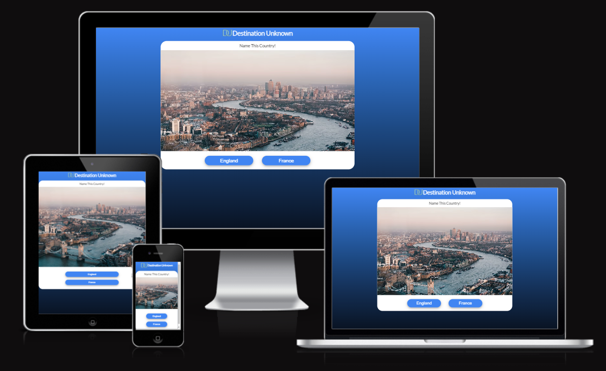

Destination Unknown
=

Introduction
=
Destination Unknown is a simple quiz game to test your geographical skills. It shows a photo of a country,
and the user has to guess which country it is by selecting one of the two options.

Users of this website will be able to play the game and test their knowledge. 

The website can be viewed here: [Desination Unknown](https://rinalds98.github.io/destination-unknown/ "Destination Unknown").

User Experience
=
## **User Stories**
- ## **As a website owner I want that:**

    1. The website provides clear and concise instructions on how the game is played.
    2. The website allows the user to input their username and be able to see their score at the end.
------

- ## **As a website user I want:**
    1. To easily understand what the quiz is about.
    2. To test their geographical skills.
    3. The answer buttons to work.
    4. To be able to track my score.
 ------

- ## **As a returning website user I want:**
    1. To be able to retry to get a higher score.

# 1. Strategy

- The main purpose of this quiz is to make it a fun and challenging experience.
- With this quiz people with an interest in geography can test their skills to find out if they know what country each location is located in.

# 2. Scope
- After multiple design choices; a simple 2-button choice design was chosen with a big image to make it aesthetically pleasing.
- It has been designed with mobile devices in mind so most smartphones and tablets can access and try the quiz.

# 3. Structure
- A start screen that explains what the quiz is about, so the user can prepare to answer the questions.
- For desktop and mobile view the quiz has the same design. To keep it simple for cross-platform use.
- The logo has been centered for both desktop and mobile. While also the logo has been made into a favicon.
- A game over screen has been implemented to tell the user the quiz has ended. It also shows the score.
- The 'footer' section provides a copyright statement.

# 4. Skeleton
## **Wireframes**
- The initial designs were made as Wireframes using 'Balsamiq'.

# 5. Surface
 - ## **Color**
    - The color theme is based on a simple blue and white design. 
    - Polygons to be added for aesthetic reasons and to add depth to the quiz (Website).
    - All of the buttons have the same shape and color. They change color once hovered over.
    - the color blue was chosen as the main color to display calmness with the idea that the user would feel relaxed as they complete the quiz.
    - The colors green and red were chosen for when the user selects a correct or wrong answer.

 - ## **Font**
    - The font 'Lato' was used throughout the website and was imported from Google Fonts.
 - ## **Favicon**
    - The favicon I opted to use was the initials of the website name which consequently is also the logo. I chose the color blue to keep the design the same.

Testing
=

## **Solved Bugs**
- On mobile devices when the user clicked an answer the button would stay white (In hover mode) this was fixed by using media queries and the 'active' pseudo-class to solve the issue

## **Unfixed Bugs**
- If the user clicks the answer buttons very quickly. It can generate extra correct answers. When you retry after the quiz doesn't work as intended anymore.

## **Validator Testing**

- **Testing**
    - I tested my website on multiple browsers including Chrome, Firefox, and Safari (IOS).
    - I also tested it on multiple devices including Laptop, Samsung S20 Ultra (Android 12), iPhone 13 Pro Max (IOS 16)

- **HTML**
    - No errors were returned when passing through the official W3C Validator.
    **Add Image**

- **CSS**
    - No Errors were found when passing through the official (Jigsaw) validator.
    **Add image**
 
 **Javascript**
    - No Errors were found when passing through the official (JShint) validator.
    **Add image**

- **Accessibility (Lighthouse)**
    - I confirmed that the colors and fonts chosen are easy to read and accessible by running it through 'Lighthouse' in Google Devtools.
    - I also confirmed that my website is fully accessible to people who are visually impaired or use screen readers.
    **Add Image**

Technologies Used
=

- ## Languages
    - HTML5
    - CSS3
    - Javascript

- ## Misc. Software
    - [Google Fonts](https://fonts.google.com/ "googlefonts") - 'Lato' was used throughout the website.
    - [Favicon](https://Favicon.io/ "Favicon") - Favicon used to convert 'PNG' into a favicon 'ICO' format.
    - [Balsamiq](https://Balsamiq.com/ "Balsamiq") - Wireframes (sketches) were created using Balsamiq.

Credits
=

## **Content**
- To set a timer, I went to stack overflow to find how to get a timer to work so it waits a few seconds before loading the next image.
    - https://stackoverflow.com/questions/5600351/javascript-change-css-color-for-5-seconds

    - [Favicon](https://Favicon.io/ "Favicon") - Favicon used to convert 'PNG' into a favicon 'ICO' format.
    - [amiresponsive](https://ui.dev/amiresponsive "amiresponsive") - amiresponsive was used to generate a responsive website image used in the README.md file. 

## **Media**

- All images were taken from [unsplash.com](https://unsplash.com/ "unsplash.com").

    - https://unsplash.com/photos/Oja2ty_9ZLM

    - https://unsplash.com/photos/N4DbvTUDikw

    - https://unsplash.com/photos/_KhePTaoa10

    - https://unsplash.com/photos/AaExF6NxvQo

    - https://unsplash.com/photos/65c5xq7Qgdk